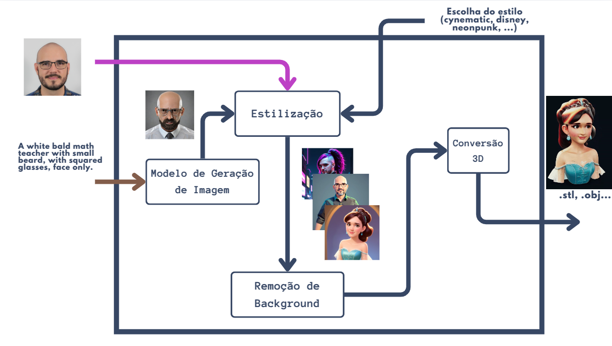

# print-it-all
generate .stl 3D files from text/images in a single pipeline

Contributors: [Fábio Papais](https://github.com/fabiopapais), [Jaubert Gualberto](https://github.com/jaubertgualberto) and [Silvânio Assunção](https://github.com/silvanio45)
